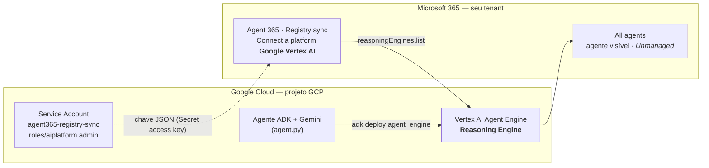

# Do Google Vertex AI ao Microsoft Agent 365 via Registry Sync

Tutorial passo a passo, **testado de ponta a ponta**, para levar um agente
**Google ADK + Gemini** — rodando no **Vertex AI Agent Engine** — até o
**Microsoft Agent 365**, onde ele passa a aparecer no registro de agentes
através do **Registry sync (preview)**.

> ### Insight principal
> O que faz um agente aparecer no Agent 365 por este caminho **não é o SDK**
> com que ele foi construído. É **estar publicado como um _Reasoning Engine_ no
> Vertex AI Agent Engine**. O Registry sync do Agent 365 lê a operação
> `aiplatform.reasoningEngines.list` — então qualquer agente publicado no Agent
> Engine (ADK, LangChain, LangGraph, etc.) é descoberto, independente do
> framework.

---

## Índice

- [Arquitetura](#arquitetura)
- [O que o Registry sync é (e o que não é)](#o-que-o-registry-sync-é-e-o-que-não-é)
- [Pré-requisitos](#pré-requisitos)
- [Fase 0 — Verificações](#fase-0--verificações)
- [Fase 1 — Agente ADK simples](#fase-1--agente-adk-simples)
- [Fase 2 — Deploy no Agent Engine](#fase-2--deploy-no-agent-engine)
- [Fase 3 — Service account + chave JSON](#fase-3--service-account--chave-json)
- [Fase 4 — Registry sync no Agent 365](#fase-4--registry-sync-no-agent-365)
- [Fase 5 — Confirmação](#fase-5--confirmação)
- ["Unmanaged" — o que significa](#unmanaged--o-que-significa)
- [Troubleshooting (problemas reais deste tutorial)](#troubleshooting-problemas-reais-deste-tutorial)
- [Limpeza / evitar custos](#limpeza--evitar-custos)
- [Segurança](#segurança)
- [Licença](#licença)


---

## Arquitetura



**Dois mundos, uma ponte:** o agente vive e roda no **Google Cloud**. O Agent 365
apenas **lê** (descobre) esse agente usando uma **service account** com a chave
JSON. Não há federação de identidade — a ponte é a chave.

---

## O que o Registry sync é (e o que não é)

| É | Não é |
|---|---|
| Descoberta + inventário de agentes externos | Runtime — o agente **não** roda dentro do Copilot/Teams |
| Visibilidade e governança centralizada | Gestão de identidade/ciclo de vida (isso é "manage") |
| Ação de **administrador** no M365 admin center | Algo que você configura por código/SDK |
| Suporta Amazon Bedrock, **Google Vertex AI**, Salesforce Agentforce, Databricks Genie | Um substituto do M365 Agents SDK / Blueprint Identity |

Doc oficial: [Registry sync in the Microsoft 365 agent registry (preview)](https://learn.microsoft.com/en-us/microsoft-agent-365/admin/agent-registry)

---

## Pré-requisitos

- **Google Cloud:** um projeto com **billing ativo** e a **Vertex AI API** habilitada.
- **`gcloud` CLI** autenticado (o **Cloud Shell** já vem pronto — recomendado).
- **Microsoft 365:** um tenant com **Agent 365 (preview)** habilitado e você com
  **papel de admin** no M365 admin center (na prática, um tenant de dev/demo onde
  você seja Global Admin — normalmente **não** o tenant corporativo).
- Python **3.10+** (o Cloud Shell atende).

> As duas identidades (sua conta Google e sua conta Microsoft) são **diferentes e
> independentes** — é esperado. Elas só se conectam via a chave JSON da service
> account, na Fase 4.

---

## Fase 0 — Verificações

```bash
# gcloud instalado, autenticado e projeto ativo
gcloud version
gcloud auth list
gcloud config list          # anote o PROJECT_ID exato (campo core.project)

# billing vinculado e ATIVO?
gcloud billing projects describe <PROJECT_ID>     # espere billingEnabled: true
gcloud billing accounts list                      # a conta vinculada deve estar OPEN: True

# habilitar a Vertex AI API (também testa billing de verdade)
gcloud services enable aiplatform.googleapis.com
gcloud services list --enabled --filter="config.name=aiplatform.googleapis.com" --format="value(config.name)"
```

**Lado Microsoft:** em `https://admin.microsoft.com` → **Agents → All Agents →
Registry sync → Manage → + Connect a platform**. Se a tela abre com o botão
**Connect a platform**, você tem o acesso necessário.

---

## Fase 1 — Agente ADK simples

```bash
mkdir -p ~/adk-agent && cd ~/adk-agent
python3 -m venv .venv
source .venv/bin/activate
pip install google-adk

# cria o esqueleto (interativo)
adk create my_agent
#   Modelo   -> gemini-2.5-flash
#   Backend  -> 2) Vertex AI
#   Project  -> <PROJECT_ID>   (ENTER aceita o default entre colchetes)
#   Region   -> us-central1
```

Confira o `.env` gerado — para o backend Vertex ele deve conter:

```dotenv
GOOGLE_GENAI_USE_ENTERPRISE=1
GOOGLE_CLOUD_PROJECT=<PROJECT_ID>
GOOGLE_CLOUD_LOCATION=us-central1
```

Rode e teste localmente:

```bash
adk run my_agent
# no prompt [user]: digite "Olá! Em uma frase, o que você faz?"
# o agente deve responder via Gemini no Vertex.  digite "exit" para sair.
```

> Veja [`my_agent/`](my_agent/) para os arquivos de exemplo.

---

## Fase 2 — Deploy no Agent Engine

```bash
# APIs usadas pelo deploy
gcloud services enable storage.googleapis.com cloudbuild.googleapis.com artifactregistry.googleapis.com

# instalar o SDK do Vertex (traz o módulo 'vertexai')
pip install "google-cloud-aiplatform[agent_engines]"

# deploy (a partir de ~/adk-agent).  --staging_bucket NÃO é mais necessário.
cd ~/adk-agent
adk deploy agent_engine \
  --project=<PROJECT_ID> \
  --region=us-central1 \
  --display_name="my-adk-agent" \
  my_agent
```

O deploy leva **alguns minutos** (build de container). Ao final imprime o
**resource name** do Reasoning Engine:

```
Deployed to Agent Platform: projects/<NUMERO>/locations/us-central1/reasoningEngines/<ID>
```

**Guarde o `reasoningEngines/<ID>`** — é o que o Registry sync enxerga.

Confirme que ele está "queryável" (a **mesma** chamada `list` que o Agent 365 faz):

```bash
curl -s -X GET \
  -H "Authorization: Bearer $(gcloud auth print-access-token)" \
  "https://us-central1-aiplatform.googleapis.com/v1/projects/<PROJECT_ID>/locations/us-central1/reasoningEngines"
# deve retornar o engine com "displayName": "my-adk-agent"
```

---

## Fase 3 — Service account + chave JSON

```bash
# 1) criar a service account
gcloud iam service-accounts create agent365-registry-sync \
  --display-name="Agent 365 Registry Sync" \
  --project=<PROJECT_ID>

# 2) conceder Vertex AI Administrator
gcloud projects add-iam-policy-binding <PROJECT_ID> \
  --member="serviceAccount:agent365-registry-sync@<PROJECT_ID>.iam.gserviceaccount.com" \
  --role="roles/aiplatform.admin"

# 3) gerar a chave JSON (é o "Secret access key" que o Agent 365 pede)
gcloud iam service-accounts keys create ~/agent365-sync-key.json \
  --iam-account=agent365-registry-sync@<PROJECT_ID>.iam.gserviceaccount.com
```

> **Menor privilégio (produção):** em vez de `roles/aiplatform.admin`, crie uma
> _custom role_ só com `aiplatform.reasoningEngines.list`, `.get` e `.delete`.

🔒 **A chave `agent365-sync-key.json` é um segredo.** Nunca a commite (o
[`.gitignore`](.gitignore) já a exclui) nem a compartilhe.

---

## Fase 4 — Registry sync no Agent 365

No **M365 admin center** (tenant onde você é admin) → **Agents → All Agents →
Registry sync → Connect a platform**:

| Campo | Valor |
|---|---|
| Name | livre (ex.: `Vertex AI - <projeto>`) |
| External platform | **Google Vertex AI** |
| Region | `us-central1` |
| Project ID | `<PROJECT_ID>` |
| **Secret access key** | **o conteúdo COMPLETO** do `agent365-sync-key.json` (o JSON inteiro, do `{` ao `}`) |

Clique em **Verify authentication** → **Save** → **Sync agents**.

> ⚠️ O campo **Secret access key** espera o **JSON inteiro**, não apenas o valor
> de `private_key`.

---

## Fase 5 — Confirmação

Em **Agents → All agents** (filtre por _Connection_), o agente
**`my-adk-agent`** aparece com **Platform: Google Cloud** e o badge
**Unmanaged**. Pronto — o objetivo foi alcançado. 🎯

---

## "Unmanaged" — o que significa

**Não é erro.** `Unmanaged` = o agente foi **descoberto e inventariado** (a
vitória: ele está visível para governança), mas o Agent 365 **não** gerencia a
identidade/ciclo de vida dele. O agente continua rodando no Vertex. "Manage"
(link _Learn how to manage_) é o passo **opcional** de trazê-lo para uma
governança mais completa (owner, Entra Agent ID, políticas).

---

## Troubleshooting (problemas reais deste tutorial)

| Sintoma | Causa | Solução |
|---|---|---|
| `404 NOT_FOUND ... models/gemini-3.5-flash was not found` | Modelo indisponível em `us-central1` | Trocar por `gemini-2.5-flash` no `agent.py` |
| Agente falha ao conectar / projeto inexistente | `PROJECT_ID` truncado no `.env` | `cat my_agent/.env` e corrigir o `GOOGLE_CLOUD_PROJECT` |
| `Deploy failed: No module named 'vertexai'` | SDK do Vertex ausente | `pip install "google-cloud-aiplatform[agent_engines]"` |
| pip: `opentelemetry ... incompatible` | Conflito de pin do `google-adk` | **Warning cosmético** — o deploy segue. Só se quebrar de fato: fixe `opentelemetry-api==1.42.1 opentelemetry-sdk==1.42.1` |
| `Secret access key` rejeitada | Colado só o `private_key` | Colar o **JSON completo** |
| `Regional Access Boundary HTTP request failed ... Account not found` | Probe opcional de _trust boundary_ do `google-auth` | **Benigno** — ignore, a auth funciona ([ref](https://github.com/googleapis/google-cloud-python/issues/17515)) |
| `--staging_bucket` esperado | Flag antiga | **Deprecated** — não é mais necessário criar bucket |

---

## Limpeza / evitar custos

O Reasoning Engine fica ativo no Vertex e pode gerar custo. Para remover:

```bash
# lista os engines e seus IDs
curl -s -H "Authorization: Bearer $(gcloud auth print-access-token)" \
  "https://us-central1-aiplatform.googleapis.com/v1/projects/<PROJECT_ID>/locations/us-central1/reasoningEngines"

# deleta um engine específico
curl -s -X DELETE -H "Authorization: Bearer $(gcloud auth print-access-token)" \
  "https://us-central1-aiplatform.googleapis.com/v1/projects/<PROJECT_ID>/locations/us-central1/reasoningEngines/<ID>?force=true"
```

No Agent 365, a conexão pode ser removida com **Permanent delete**; o agente
some do registro no próximo sync.

---

## Segurança

- **Nunca** commite `*-key.json` nem `.env` (já cobertos pelo `.gitignore`).
- Prefira **menor privilégio** (custom role com as 3 permissões `reasoningEngines`)
  em vez de `roles/aiplatform.admin` para cargas reais.
- Rotacione/rmova a chave da service account quando não precisar mais:
  `gcloud iam service-accounts keys list --iam-account=...` e `... keys delete`.

---

## Licença

[MIT](LICENSE) © 2026 Paulo Soares
