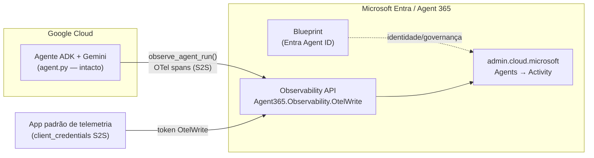

# Parte 2 — Do *Unmanaged* ao *Managed* (Entra Agent ID + Observability)

> **TL;DR (English).** Part 1 made a Google **Vertex AI / ADK + Gemini** agent
> *visible* in Microsoft Agent 365 via **Registry sync** (status: **Unmanaged**).
> Part 2 gives that same agent its **own Entra identity** and wires **Agent 365
> Observability**, moving it toward **Managed** — **without touching `agent.py`**.
> We used the **Agent 365 CLI (`a365`)** + **Azure CLI** to (1) create the agent
> **blueprint** (Entra app identity), (2) grant **`Agent365.Observability.OtelWrite`**
> (delegated **+ application/S2S**), and (3) create a **standard (non‑agentic)
> Entra app** for the telemetry S2S token. On the code side we added the
> **`microsoft-opentelemetry`** distro plus a small, non‑invasive
> `observability.py` bootstrap (MSAL client‑credentials token resolver + manual
> `InvokeAgent` spans, since Google ADK has **no auto‑instrumentor**). Everything
> **degrades to a no‑op** when unconfigured. **Honest limits:** telemetry
> *ingestion* needs an **Agent 365 / M365 E7** license (governance via Entra
> Agent ID works on **E5 + Entra ID P2**); the blueprint’s **agentic FMI** token
> chain isn’t available to a plain ADK runtime, so we used a standard‑app S2S
> token; the **AI teammate** tier needs **Frontier**. No secrets are included in
> this document.

---

## Índice

- [1. Visão geral: de *Unmanaged* a *Managed*](#1-visão-geral-de-unmanaged-a-managed)
- [2. Pré-requisitos](#2-pré-requisitos)
- [3. Passo a passo reproduzível](#3-passo-a-passo-reproduzível)
- [4. Recursos criados](#4-recursos-criados)
- [5. Arquivos adicionados/alterados](#5-arquivos-adicionadosalterados)
- [6. Notas de design](#6-notas-de-design)
- [7. Ressalvas e limitações honestas](#7-ressalvas-e-limitações-honestas)
- [8. Fazendo com E7 / Agent 365 (licenciado)](#8-fazendo-com-e7--agent-365-licenciado)
- [9. Segurança](#9-segurança)

---

## 1. Visão geral: de *Unmanaged* a *Managed*

Na [Parte 1](../README.md) o agente **Google Vertex AI / ADK + Gemini** aparece
no Agent 365 via **Registry sync**, com o badge **Unmanaged** — ou seja, ele é
**descoberto e inventariado**, mas o Agent 365 **não** gerencia a identidade nem
o ciclo de vida dele.

Esta Parte 2 dá o próximo passo de governança:

1. **Identidade própria (Entra Agent ID):** criamos um **blueprint** — uma
   *application registration* de agente no Microsoft Entra — que passa a ser a
   identidade do agente para fins de governança.
2. **Observability:** concedemos ao blueprint a permissão
   **`Agent365.Observability.OtelWrite`** (delegated **e** application/S2S) e
   instrumentamos o agente para emitir *traces* OpenTelemetry ao serviço de
   observabilidade do Agent 365.
3. **Sem reescrever nada:** `agent.py` e o `root_agent` permanecem **intactos**.
   Toda a instrumentação vive em um módulo separado e **degrada para no-op**
   quando não configurada.



> **Nota sobre identidade da telemetria.** O blueprint é o que torna o agente
> *Managed* do ponto de vista de **governança**. Para o **token S2S de
> ingestão** usamos um **app padrão separado** (ver
> [Notas de design](#6-notas-de-design) e [Ressalvas](#7-ressalvas-e-limitações-honestas)).

---

## 2. Pré-requisitos

- **Microsoft Entra — Global Administrator** no tenant de destino (aqui:
  `nicdux.com.br` / *Bitahon*). É preciso para criar o app do CLI, o blueprint e
  para conceder *admin consent* tenant-wide.
- **Frontier Preview Program** — o tenant deve estar inscrito no programa
  *Frontier* do Copilot/Agent 365 (o `a365 setup requirements` **não** consegue
  verificar isso automaticamente e emite um *warning*). Ver
  <https://adoption.microsoft.com/copilot/frontier-program/>.
- **Ferramentas de linha de comando** (todas já presentes nesta sessão):
  - **.NET SDK** `10.0.301`
  - **Azure CLI** `2.87.0`
  - **Agent 365 CLI (`a365`)** `1.1.214`
    (instala como *dotnet tool*; em shells novos pode não estar no `PATH` — use o
    caminho completo `~/.dotnet/tools/a365.exe` se necessário).
- **Licenciamento** (leia com atenção — ver [Ressalvas](#7-ressalvas-e-limitações-honestas)):
  - **Governança** (Entra Agent ID / blueprint): **Microsoft 365 E5 + Entra ID P2**.
  - **Observability — ingestão de telemetria**: requer um usuário do tenant com
    **Microsoft 365 E7** *ou* licença **Agent 365** **atribuída**. Sem isso, a
    ingestão é **silenciosamente descartada**.
  - **AI teammate** (mailbox/identidade no Teams): requer **Frontier**.

---

## 3. Passo a passo reproduzível

> Os comandos abaixo são **exatamente** os executados nesta sessão. Valores
> sensíveis (segredos) **nunca** aparecem — apenas IDs não sensíveis.

### 3.1 — Login no Azure (tenant correto)

```powershell
az login
az account show --output json   # confirmar tenantId = bff1a398-3f36-4452-b361-c6b58e4883fa
```

### 3.2 — Validar pré-requisitos do Agent 365

```powershell
a365 setup requirements
```

- Na primeira execução, o CLI detecta que o app **"Agent 365 CLI"** ainda não
  existe no tenant e pergunta: `Enter a client app ID, or [C] to create one:` →
  respondemos **`C`**.
- Ele então cria o app do CLI e pede *admin consent* para as permissões de Graph
  do Agent 365 → respondemos **`y`**.
- Resultado final: `Requirements: 2 passed, 0 warnings, 0 failed`
  (mais o *warning* benigno de **Frontier Preview**, que não pode ser verificado
  automaticamente).

### 3.3 — Criar o blueprint (identidade Entra do agente)

Como o agente roda no **Vertex AI** (e não é um endpoint de mensageria do Teams),
usamos `--no-endpoint` para criar **apenas** a identidade:

```powershell
a365 setup blueprint --agent-name "my-adk-agent" --no-endpoint
```

Saída relevante:

- `Blueprint ID: 9b998b6c-546b-4a3b-9057-a53230106f19`
- `Blueprint service principal ID: 8441b93a-e602-427a-95e3-48eac0273f1b`
- Display name: `my-adk-agent Blueprint`
- Um **client secret do blueprint** é impresso **uma única vez** e também é
  armazenado (protegido por DPAPI) em `a365.generated.config.json`.
  ⚠️ **Rotacione-o** — ver [Ressalvas](#7-ressalvas-e-limitações-honestas).
  Para recuperá-lo depois, na mesma máquina/usuário/pasta:
  `a365 setup blueprint --show-secret`.

### 3.4 — Conceder Observability (bundle `permissions bot`)

O CLI não tem um subcomando "somente observability"; a permissão de Observability
vem no *bundle* `bot` (Bot API + **Observability** + Power Platform). Antes de
executar, inspecionamos com `--dry-run` para ver o que seria concedido:

```powershell
a365 setup permissions bot --agent-name "my-adk-agent" --dry-run --verbose
```

Que revelou:

- Messaging Bot API: `AgentData.ReadWrite`
- **Observability API: `Agent365.Observability.OtelWrite` (delegated + application)** ← o objetivo
- Power Platform API: `Connectivity.Connections.Read`

Executamos então de verdade (aceitando o *bundle*):

```powershell
a365 setup permissions bot --agent-name "my-adk-agent"
```

Durante a execução:

- `Assign this application permission now? [y/N]:` → **`y`** (concede a permissão
  **application/S2S** `Agent365.Observability.OtelWrite`).
- O CLI provisiona um *service principal* faltante para a **Messaging Bot API**
  (`5a807f24-c9de-44ee-a3a7-329e88a00ffc`) via `az ad sp create` → **`y`**
  (SP criado: `b672941a-3363-4ba9-979b-7c3ddd8c2ad2`).
- Abre o navegador para *admin consent* das permissões *delegated* → **Accept**.
- Resultado: `Bot API permissions configured successfully`.

### 3.5 — App padrão (não-agentic) para o token S2S da telemetria

Um blueprint (app *agentic*) **não** pode usar `client_credentials` puro contra o
recurso de observabilidade (retorna `AADSTS82001`). Para a **ingestão S2S** de
telemetria a partir de um runtime ADK (que não usa o M365 Agents SDK), criamos um
**app padrão** dedicado.

Primeiro, descobrir o **app-role ID** de `Agent365.Observability.OtelWrite` no
recurso de observabilidade:

```powershell
az ad sp show --id 9b975845-388f-4429-889e-eab1ef63949c `
  --query "{displayName:displayName, appId:appId, otelWrite:appRoles[?value=='Agent365.Observability.OtelWrite'].{id:id,value:value}}" -o json
# -> app-role id: 8f71190c-00c8-461d-a63b-f74abde9ba52  (recurso: maven-prod)
```

Criar o app e o *service principal*:

```powershell
az ad app create --display-name "my-adk-agent Observability" --sign-in-audience AzureADMyOrg
# AppId (client id): ec773acb-119c-4cb0-b65f-8485321770fe
# App objectId:      35d7bf17-1e24-44c1-a0e9-9a79dc11a308
az ad sp create --id ec773acb-119c-4cb0-b65f-8485321770fe
# SP objectId:       a716c299-9fc6-4171-ae74-6652cef3f489
```

Adicionar a permissão de aplicação e **conceder** via *app-role assignment*
determinístico (mais confiável que `admin-consent` em CLI):

```powershell
# 1) adiciona ao manifesto do app (registro de consentimento)
az ad app permission add --id ec773acb-119c-4cb0-b65f-8485321770fe `
  --api 9b975845-388f-4429-889e-eab1ef63949c `
  --api-permissions "8f71190c-00c8-461d-a63b-f74abde9ba52=Role"

# 2) resolve o objectId do SP do recurso de observabilidade
az ad sp show --id 9b975845-388f-4429-889e-eab1ef63949c --query id -o tsv
# -> 20cceefe-4f9a-44c0-b6a7-3fa3272bff2c

# 3) cria o appRoleAssignment (a concessão application/S2S de fato)
#    body = { principalId: <nosso SP>, resourceId: <SP do recurso>, appRoleId: <OtelWrite> }
az rest --method POST `
  --uri "https://graph.microsoft.com/v1.0/servicePrincipals/a716c299-9fc6-4171-ae74-6652cef3f489/appRoleAssignments" `
  --headers "Content-Type=application/json" `
  --body "@<arquivo-json-temporário>"
# -> principalDisplayName: "my-adk-agent Observability" ; resourceDisplayName: "maven-prod"
```

### 3.6 — Gerar o secret **com segurança** (direto no `.env`, sem exibir)

O secret do app de telemetria foi criado e **escrito diretamente no `.env`**
(que está no `.gitignore`), **sem** nunca ser impresso no terminal/chat — apenas
uma confirmação mascarada (comprimento):

```powershell
$sec = az ad app credential reset --id ec773acb-119c-4cb0-b65f-8485321770fe `
        --display-name "observability-s2s" --years 1 --query password -o tsv
(Get-Content .env.sample) -replace '^AGENT365_OBSERVABILITY_CLIENT_SECRET=.*', `
  "AGENT365_OBSERVABILITY_CLIENT_SECRET=$sec" | Set-Content -Path .env -Encoding utf8
if ($sec) { "OK: wrote .env, secret length=$($sec.Length)" }   # -> length=40
```

> O valor do segredo **não** aparece em lugar nenhum: é capturado numa variável,
> gravado no arquivo e descartado. `.env` é ignorado pelo Git.

---

## 4. Recursos criados

> **Somente IDs não sensíveis.** Nenhum segredo é listado.

| Recurso | Tipo | ID |
|---|---|---|
| **Agent 365 CLI** | App registration (client do CLI) | `c75eed4b-ff3e-4680-88dc-9d1a302853ee` |
| **my-adk-agent Blueprint** | Blueprint app (client ID) | `9b998b6c-546b-4a3b-9057-a53230106f19` |
| **my-adk-agent Blueprint** | Service principal (object ID) | `8441b93a-e602-427a-95e3-48eac0273f1b` |
| **my-adk-agent Observability** | App de telemetria (client ID = `agentId`) | `ec773acb-119c-4cb0-b65f-8485321770fe` |
| **my-adk-agent Observability** | Service principal (object ID) | `a716c299-9fc6-4171-ae74-6652cef3f489` |
| **Agent365.Observability.OtelWrite** | App-role concedida (delegated + application) | `8f71190c-00c8-461d-a63b-f74abde9ba52` |
| Messaging Bot API | SP provisionado pelo `permissions bot` | `b672941a-3363-4ba9-979b-7c3ddd8c2ad2` |
| Observability resource (`maven-prod`) | Recurso alvo (appId) | `9b975845-388f-4429-889e-eab1ef63949c` |

Contexto do tenant: `bff1a398-3f36-4452-b361-c6b58e4883fa` (`nicdux.com.br` / Bitahon).

---

## 5. Arquivos adicionados/alterados

> `my_agent/agent.py` e o `root_agent` **NÃO** foram tocados.

| Arquivo | O que faz |
|---|---|
| [`my_agent/observability.py`](../my_agent/observability.py) | **Novo.** `init_observability()` (configura o distro `microsoft-opentelemetry` no endpoint S2S), um **token resolver** MSAL `client_credentials` para o escopo `api://9b975845-388f-4429-889e-eab1ef63949c/.default`, e o context manager `observe_agent_run()` que emite **spans `InvokeAgent` manuais** (`BaggageBuilder` + `InvokeAgentScope`). *Imports* preguiçosos → **no-op** se o SDK não estiver instalado ou a identidade não estiver configurada. |
| [`my_agent/__init__.py`](../my_agent/__init__.py) | **Alterado.** Faz `load_dotenv()` (se `python-dotenv` existir) e chama `init_observability()` no *import* do pacote. Não altera `agent.py`. |
| [`requirements.txt`](../requirements.txt) | **Novo.** `google-adk`, `google-cloud-aiplatform[agent_engines]`, `microsoft-opentelemetry`, `msal`, `python-dotenv`. |
| [`.env.sample`](../.env.sample) | **Novo.** Template (versionado) com `AGENT365_TENANT_ID`, `AGENT365_OBSERVABILITY_CLIENT_ID` e o campo do secret **em branco**. |
| [`.gitignore`](../.gitignore) | **Endurecido.** Passou a ignorar também `a365.generated.config.json` e `a365.config.json` (além de `.env`, `*-key.json` etc., já presentes). |
| `.env` | **Não versionado.** Recebe o secret do app de telemetria (gerado com segurança, ver 3.6). |

### Comportamento do `observability.py` (resumo)

- **`init_observability()`** — idempotente. Chama
  `use_microsoft_opentelemetry(enable_a365=True, a365_token_resolver=…,
  a365_use_s2s_endpoint=True, a365_enable_observability_exporter=True, …)`.
  Retorna `False` (no-op) se desabilitado, não configurado, ou sem SDK.
- **`_token_resolver(agent_id, tenant_id)`** — usa MSAL
  `ConfidentialClientApplication.acquire_token_for_client` com o escopo
  `api://9b975845-388f-4429-889e-eab1ef63949c/.default`. Nunca deixa erro de
  telemetria quebrar o agente.
- **`observe_agent_run(...)`** — context manager para embrulhar cada invocação
  com `BaggageBuilder().tenant_id(...).agent_id(...)` + `InvokeAgentScope`
  (sem `tenant_id`/`agent_id` no baggage, o exporter **descarta** os spans).

---

## 6. Notas de design

- **Token S2S por app padrão.** Um app *agentic* (blueprint) não faz
  `client_credentials` puro no recurso de observabilidade (`AADSTS82001`). Logo,
  para ingestão S2S a partir de um runtime **ADK** (que não é o M365 Agents SDK),
  usamos um **app padrão dedicado** com `Agent365.Observability.OtelWrite`
  (Application) e MSAL `client_credentials`; o `agentId` na URL de exportação é o
  **client ID desse app** (`ec773acb-…`).
- **Instrumentação manual.** O Google ADK **não** tem *auto-instrumentor* no
  Agent 365 (existem apenas para Semantic Kernel, OpenAI, Agent Framework e
  LangChain). Por isso emitimos spans manualmente via `observe_agent_run()`.
- **Degradação graciosa (no-op).** Todos os *imports* do SDK são preguiçosos e
  protegidos por `try/except`. Se o pacote não estiver instalado ou a identidade
  não estiver no `.env`, o agente roda **exatamente como antes**.
- **Endpoint S2S.** O exporter envia OTLP/HTTP para
  `https://agent365.svc.cloud.microsoft/observabilityService/tenants/{tenantId}/otlp/agents/{agentId}/traces?api-version=1`
  (a rota *delegated* usa `/observability/` em vez de `/observabilityService/`).

---

## 7. Ressalvas e limitações honestas

1. **Rotacione o client secret do blueprint.** Durante o `a365 setup blueprint`,
   o secret do blueprint foi **impresso em texto plano** no terminal. Trate-o
   como potencialmente exposto e **rotacione** antes de uso em produção. (O
   secret do app de telemetria, por outro lado, foi gravado direto no `.env` sem
   exibição.)
2. **Ingestão de Observability exige E7 / Agent 365.** A **governança** (Entra
   Agent ID / blueprint) funciona com **E5 + Entra ID P2**. Mas a **ingestão de
   telemetria** requer um usuário com **M365 E7** *ou* **Agent 365** **atribuído**
   ao tenant — **sem isso a telemetria é silenciosamente descartada** (o código,
   os tokens e o export continuam “funcionando”, mas nada aparece no admin center).
3. **ADK ≠ runtime do M365 Agents SDK.** A cadeia de token **agentic FMI** do
   blueprint (`get_agentic_application_token` + *Federated Managed Identity*)
   depende do runtime do M365 Agents SDK, que um agente ADK **não** executa. Por
   isso usamos o **token S2S do app padrão**. Consequência: no admin center a
   telemetria aparece sob o **app de telemetria**, não sob o appId do blueprint.
4. **AI teammate exige Frontier.** O tier de *AI teammate* (mailbox/identidade no
   Teams) depende de inscrição no **Frontier Preview** — que o
   `a365 setup requirements` não consegue confirmar automaticamente.

---

## 8. Fazendo com E7 / Agent 365 (licenciado)

O que **muda** quando o tenant tem a licença adequada atribuída:

- **A telemetria realmente ingere.** Com **M365 E7 / Agent 365** atribuído, os
  spans emitidos por `observe_agent_run()` passam a aparecer em
  **`admin.cloud.microsoft` → Agents → (seu agente) → Activity** (sessões,
  chamadas de ferramenta, invocações de modelo). Sem a licença, tudo é descartado
  silenciosamente.
- **Caminho agentic FMI opcional (blueprint).** Num runtime que use o **M365
  Agents SDK** (ou a plumbing de **Entra Agent ID / FMI**), é possível trocar o
  token S2S do app padrão pela **cadeia agentic do próprio blueprint**
  (`get_agentic_application_token` → MSAL com `client_assertion` →
  `api://9b975845-…/.default`). Aí o `agentId` passa a ser a **identidade de
  instância do agente** derivada do blueprint, e a telemetria fica atrelada à
  identidade governada.
- **Tier AI teammate.** Com **Frontier** + licença, o agente pode receber
  identidade completa de *teammate* (mailbox, presença no Teams), habilitando os
  cenários de colaboração/gestão de ciclo de vida do Agent 365.

---

## 9. Segurança

- **Nunca** faça commit de segredos. O `.gitignore` já exclui:
  `.env`, `*-key.json`, `*-sync-key.json`, `service-account*.json`,
  `credentials*.json`, `*.pem`, e agora também
  **`a365.generated.config.json`** e **`a365.config.json`**.
- O secret do app de telemetria vive **somente** no `.env` local (não versionado).
- O secret do blueprint fica protegido por **DPAPI** em
  `a365.generated.config.json` (ignorado) e deve ser **rotacionado**.
- Prefira **menor privilégio**: comece **só com Observability**; conceda Bot API /
  Power Platform apenas se realmente for usar (nesta sessão eles vieram no
  *bundle* `bot` e foram aceitos conscientemente).

---

[⬅ Voltar para a Parte 1 (Registry sync)](../README.md) · [MIT](../LICENSE) © 2026 Paulo Soares
